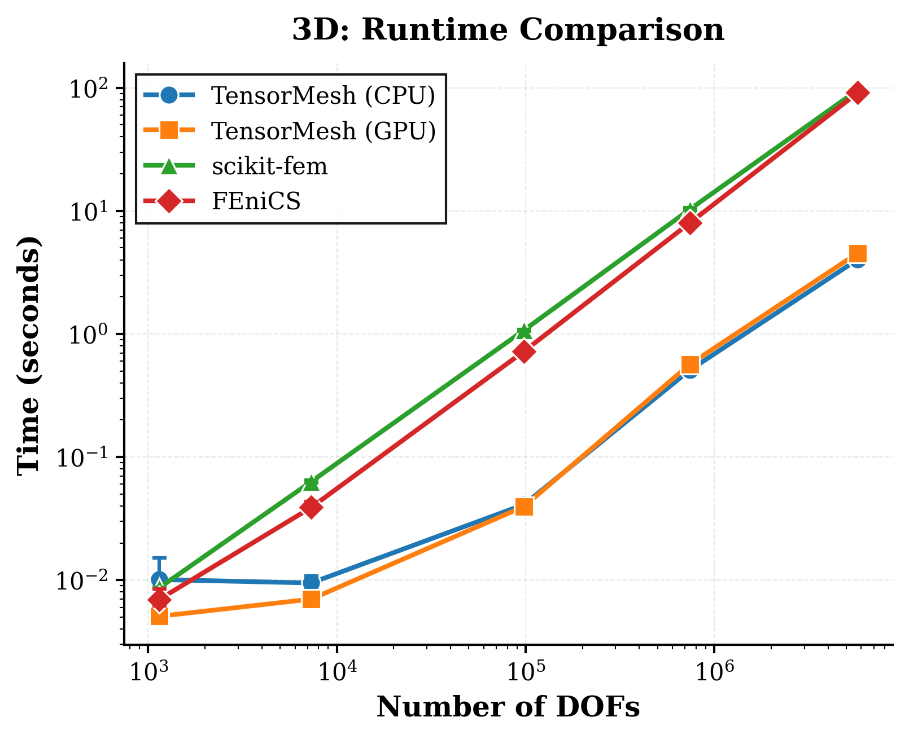
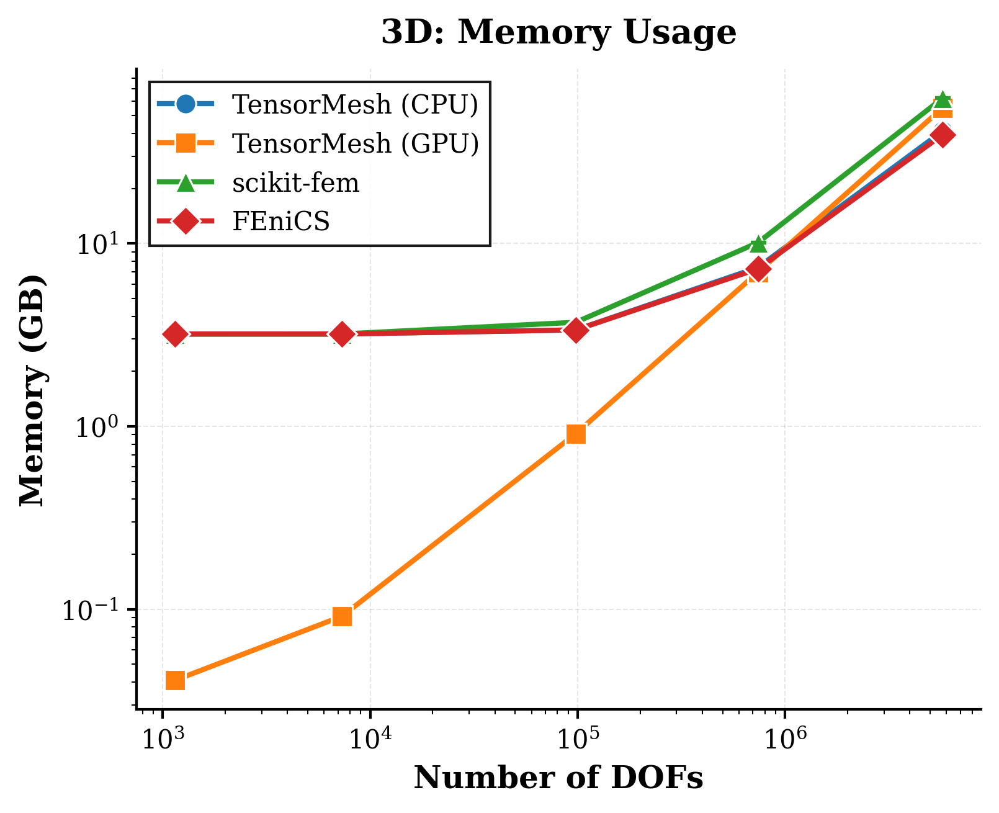
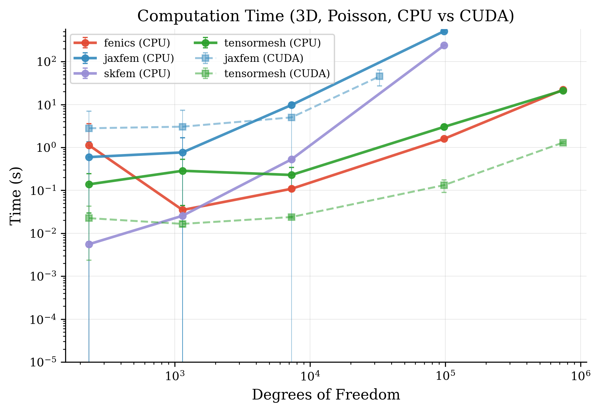

Benchmark
=========

Test Environment
----------------

The benchmarks listed below were evaluated in the following environment:

*   **CPU**: Intel(R) Xeon(R) Platinum 8468
*   **GPU**: NVIDIA H200 (141 GB VRAM)
*   **OS**: Linux

Assemble Speed 
--------------

Pipeline Speed
--------------

Solve the Poisson problem.

Dataset Generation Benchmark
----------------------------

Benchmark for ``PoissonMultiFrequency.source_term`` & ``solution`` generation speed and memory usage.

The ``PoissonMultiFrequency`` class generates analytical solutions for the Poisson equation with multi-frequency source terms:

.. math::

    -\Delta u = f, \quad u|_{\partial \Omega} = 0

where the source term is a sum of sinusoidal modes:

.. math::

    f(x) = \sum_{i,j=1}^{K} a_{ij} \cdot (i^2 + j^2) \pi^2 \sin(i \pi x) \sin(j \pi y)

and the corresponding analytical solution is:

.. math::

    u(x) = \sum_{i,j=1}^{K} a_{ij} \sin(i \pi x) \sin(j \pi y)

.. image:: ../_static/benchmark/bench_time_K16_loglog.png
   :width: 100%
   :align: center
   :alt: Time Benchmark

.. image:: ../_static/benchmark/bench_mem_K16_loglog.png
   :width: 100%
   :align: center
   :alt: Memory Benchmark
