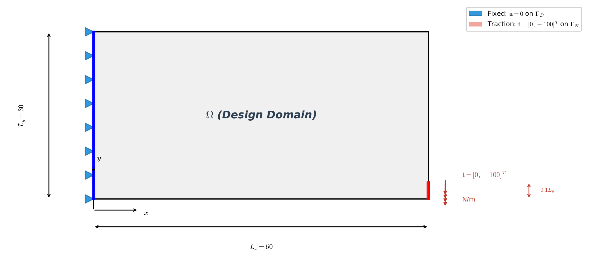
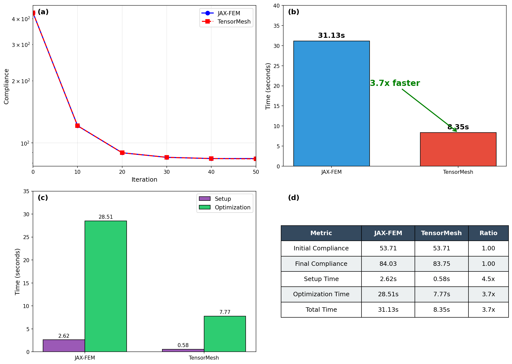
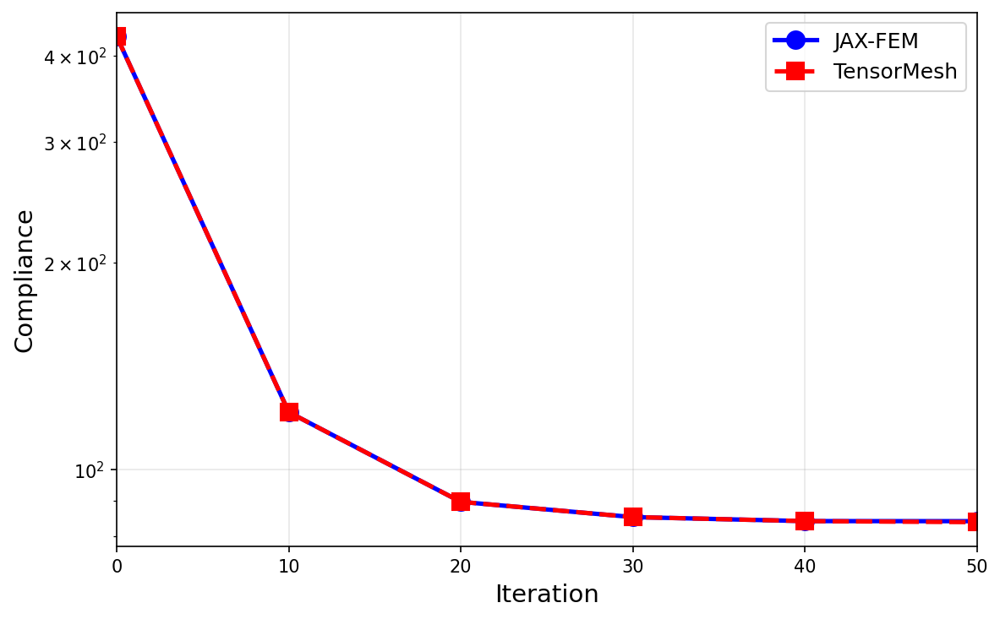

Benchmark
=========

This page presents comprehensive benchmarks comparing TensorMesh with other popular FEM frameworks.

Test Environment
----------------

*   **CPU**: Intel(R) Xeon(R) Platinum 8468
*   **GPU**: NVIDIA H200 (141 GB VRAM)
*   **OS**: Linux

Compared Frameworks
-------------------

.. list-table::
   :header-rows: 1
   :widths: 20 15 10 10 45

   * - Framework
     - Language
     - CPU
     - CUDA
     - Notes
   * - `FEniCS <https://fenicsproject.org/>`_
     - C++/Python
     - ✅
     - ❌
     - Reference implementation
   * - `scikit-fem <https://github.com/kinnala/scikit-fem>`_
     - Python
     - ✅
     - ❌
     - Lightweight, pure Python
   * - `JAX-FEM <https://github.com/tianjuxue/jax-fem>`_
     - JAX
     - ✅
     - ✅
     - Differentiable FEM
   * - **TensorMesh**
     - PyTorch
     - ✅
     - ✅
     - GPU-accelerated FEM

Solver Configuration
--------------------

All benchmarks use unified solver settings for fair comparison:

.. list-table::
   :header-rows: 1
   :widths: 30 70

   * - Parameter
     - Value
   * - Method
     - BiCGSTAB
   * - Relative Tolerance
     - 1e-10
   * - Absolute Tolerance
     - 1e-10
   * - Max Iterations
     - 10000
   * - Preconditioner
     - Jacobi

Poisson Equation (3D)
---------------------

Solve the Poisson equation :math:`-\Delta u = f` with Dirichlet boundary conditions.

.. list-table::
   :widths: 50 50

   * - **Solve Time**
     - **Residual Convergence**
   * - .. image:: ../_static/benchmark/poisson_time_3d_combined.png
          :width: 100%
     - .. image:: ../_static/benchmark/poisson_residual_3d.png
          :width: 100%

Linear Elasticity (3D)
----------------------

Solve the linear elasticity equation with fixed and traction boundary conditions.

.. list-table::
   :widths: 50 50

   * - **Solve Time**
     - **Residual Convergence**
   * - .. image:: ../_static/benchmark/elasticity_time_3d.png
          :width: 100%
     - .. image:: ../_static/benchmark/elasticity_residual_3d.png
          :width: 100%

Topology Optimization (Inverse Problem)
---------------------------------------

Comparison of topology optimization using SIMP method between JAX-FEM and TensorMesh.

**Problem Setup:**

- Domain: 60 × 30 (1800 QUAD4 elements)
- Left boundary fixed, right-bottom corner loaded
- Volume fraction constraint: 50%

**Performance Comparison:**

.. list-table::
   :header-rows: 1
   :widths: 30 20 20 30

   * - Metric
     - JAX-FEM
     - TensorMesh
     - Speedup
   * - Setup time
     - 2.62 s
     - 0.58 s
     - **4.5×**
   * - Optimization (51 iters)
     - 28.51 s
     - 7.77 s
     - **3.7×**
   * - **Total time**
     - **31.13 s**
     - **8.35 s**
     - **3.7× 🚀**

**Accuracy Comparison:**

.. list-table::
   :header-rows: 1
   :widths: 35 25 25 15

   * - Accuracy
     - JAX-FEM
     - TensorMesh
     - Status
   * - Initial Compliance
     - 53.71
     - 53.71
     - ✅ Match
   * - Final Compliance
     - 84.03
     - 83.75
     - ✅ 0.33% diff
   * - Volume Fraction
     - 0.500
     - 0.500
     - ✅ Match

**Optimization Result:**

**Convergence Comparison:**

See :doc:`../examples/inverse` for detailed implementation.

Assembly Benchmark
------------------

Stiffness matrix assembly performance comparison.

.. figure:: ../_static/comparison_asm_3d_time.png
   :alt: 3D Assembly Runtime Comparison

.. figure:: ../_static/comparison_asm_3d_memory.png
   :alt: 3D Assembly Memory Usage

Full Pipeline Benchmark
-----------------------

End-to-end pipeline performance for solving the Poisson problem.

.. figure:: ../_static/pipeline_compare_3d.png
   :alt: Pipeline Speed Comparison

Dataset Generation Benchmark
----------------------------

Benchmark for ``PoissonMultiFrequency.source_term`` & ``solution`` generation speed and memory usage.

The ``PoissonMultiFrequency`` class generates analytical solutions for the Poisson equation with multi-frequency source terms:

.. math::

    -\Delta u = f, \quad u|_{\partial \Omega} = 0

where the source term is a sum of sinusoidal modes:

.. math::

    f(x) = \sum_{i,j=1}^{K} a_{ij} \cdot (i^2 + j^2) \pi^2 \sin(i \pi x) \sin(j \pi y)

and the corresponding analytical solution is:

.. math::

    u(x) = \sum_{i,j=1}^{K} a_{ij} \sin(i \pi x) \sin(j \pi y)

.. image:: ../_static/benchmark/bench_time_K16_loglog.png
   :width: 100%
   :align: center
   :alt: Time Benchmark

.. image:: ../_static/benchmark/bench_mem_K16_loglog.png
   :width: 100%
   :align: center
   :alt: Memory Benchmark
